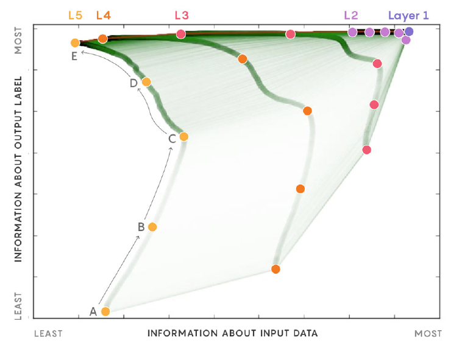

# Message-in-a-Bottle

The fundamental challenge of statistical learning is to represent the information from one variable that is relevant to the prediction of another.  Algorithms must navigate a trade off between compressing the representation of input features and preserving the meaningful information for prediction of the output responses.  Naftali Tishby et al. describe this process as squeezing "the information that X provides about Y through a bottleneck" (cite Tishby, Bialek 1999). They formalize this process using an information theoretic approach, which they termed the the Information Bottleneck Method (cite Tishby and Polani 2006).    

Shannon's Information Theory and its close cousin, the Information Bottleneck Method, have provided a new perspective on the recent successes of Deep Learning.  Specifically, they have provided insight on the value of depth in neural networks and the use of the "information plane" as a powerful tool for understanding learning dynamics.

    
    
<i>Plot of layers from a neural network in the information plane during training.</i>

For our final project in CS229 we propose a multifaceted study of the information plane as a powerful tool for visualizing learning, finding the limits of model generalization and designing information performance driven cost functions. Our proposal is best classified as an algorithm development project in the Theory \& Reinforcement Learning category.  Our project will consist of the following three stages:

1. **Replicate:** We will first attempt to replicate Tishby et al.'s results at modeling each layer in a convolutional neural network in the information plane (see the following [lecture](https://www.youtube.com/watch?v=bLqJHjXihK8})).  Our greatest challenge in this stage will be accurately measuring the mutual information between our input features/output response and the state of any layer in our network. To do this we will rely on research published by Tishby's lab and other groups exploring this space.   
    
2. **Extend:** Once we have successfully replicated Tishby et al.'s results, we will attempt to extend these results to other supervised learning techniques.  Specifically we will focus on support vector machines, Hu's moment invariants and recurrent neural networks.  We plan on using the MNIST and CIFAR10 database for this stage. Below are a couple of the questions we hope to answer:
    
+ Where do existing learning techniques put you in the information plane? 
+ Can we make a connection between the information plane way of understanding the performance of an algorithm and the standard test error and validation error metrics?
    
    
3. **Explore:** Lastly, we will explore the use of mutual information as a measure of performance in designing new learning algorithms, specifically to address unsupervised problems.  Below are a couple of questions and ideas we hope to explore:
    
+ Can we use the position in the information plane as a cost function?
+ Can we estimate this cost function gradient through numerical sampling?
+ How would gradient naive MC methods work in optimizing this cost function?
+ How about a Genetic Algorithm with a information plane fitness?

Statistical learning at its core can be understood as a constrained compression problem.  We hope to use the theoretical framework and visual language proposed by Naftali Tishby to investigate current machine learning methods and develop techniques and measures for new ones.

## File Structure

+ test.py - Main file that calls other functionality and generates plots
+ generate_data.py - Generate data from different distributions
+ info_measures.py - Estimates measures of information
+ ml_algorithms.py - Implements different learning algorithms

